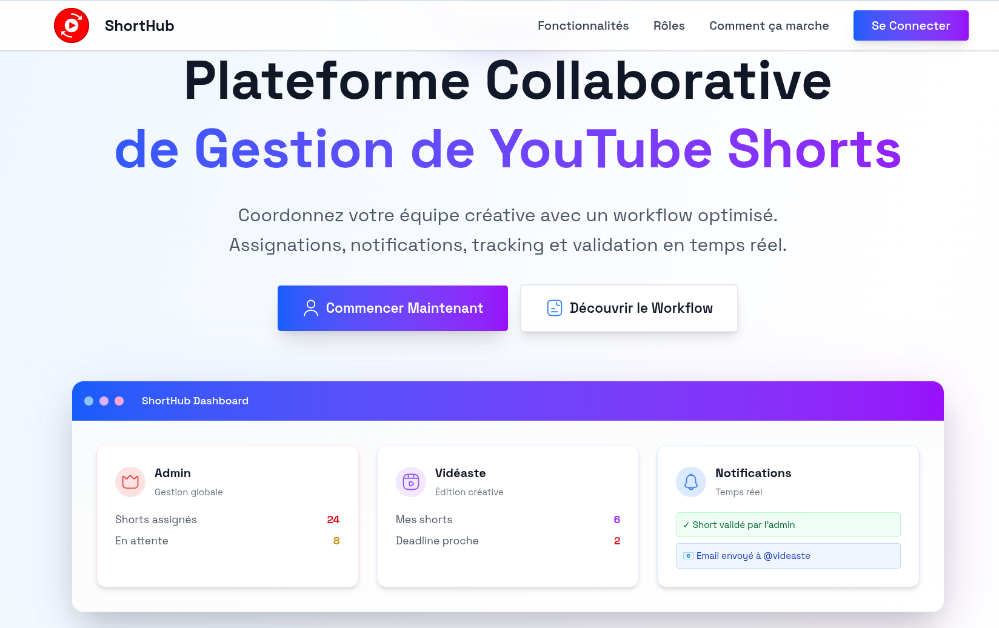

# ShortHub - YouTube Shorts Manager

<div align="center">
  
  
  <h3>Streamline Your YouTube Shorts Workflow</h3>
  <p>A comprehensive platform for managing YouTube channels and automating Shorts discovery and validation</p>

  
</div>

## 🎯 Overview

ShortHub is a modern web application designed to optimize YouTube Shorts content management. It enables content creators and managers to efficiently discover, validate, and track YouTube Shorts from their registered channels.

### Key Features

- **📺 Channel Management**: Register and organize YouTube channels with tags and categories
- **🎲 Smart Shorts Rolling**: Generate random YouTube Shorts from registered channels
- **✅ Validation System**: Track validated content to avoid duplicates
- **📊 Analytics Dashboard**: Monitor performance with detailed statistics
- **🏷️ Advanced Tagging**: Organize channels by language (VF, VOSTFR, VA, VOSTA, VO) and content type
- **🔧 Browser Extension**: Add channels directly from YouTube pages

## 🚀 Tech Stack

### Frontend
- **React 19** with TypeScript
- **Vite** for build tooling
- **TailwindCSS** for styling
- **React Router v7** for navigation
- **Iconsax React** for icons

### Backend & Database
- **Supabase** for database and authentication
- **YouTube Data API v3** for channel data extraction

### UI Components
- Custom form components with validation
- Modal system for data management
- Toast notifications for user feedback
- Responsive design with mobile support

## 📋 Prerequisites

Before getting started, ensure you have:

- **Node.js** (v18 or higher)
- **npm** or **yarn**
- **Supabase** account and project
- **YouTube Data API** key (optional, for automatic data extraction)

## 🛠️ Installation

1. **Clone the repository**
   ```bash
   git clone https://github.com/your-username/shorthub.git
   cd shorthub
   ```

2. **Install dependencies**
   ```bash
   npm install
   ```

3. **Environment setup**
   ```bash
   cp .env.example .env
   ```

4. **Configure environment variables**
   ```env
   # Supabase Configuration
   VITE_SUPABASE_URL=https://your-project-id.supabase.co
   VITE_SUPABASE_ANON_KEY=your-anon-key-here

   # YouTube API Configuration (optional)
   VITE_YOUTUBE_API_KEY=your-youtube-api-key-here

   # App Configuration
   VITE_APP_NAME=ShortHub
   VITE_APP_VERSION=1.0.0
   ```

5. **Database setup**
   
   Execute the following SQL in your Supabase SQL Editor:

   ```sql
   -- Create custom types
   CREATE TYPE tag_type AS ENUM ('VF', 'VOSTFR', 'VA', 'VOSTA', 'VO');
   CREATE TYPE channel_type AS ENUM ('Mix', 'Only');

   -- Channels table
   CREATE TABLE channels (
     id UUID DEFAULT gen_random_uuid() PRIMARY KEY,
     youtube_url TEXT NOT NULL UNIQUE,
     username TEXT NOT NULL,
     subscriber_count INTEGER DEFAULT 0,
     tag tag_type NOT NULL,
     type channel_type NOT NULL,
     domain TEXT,
     created_at TIMESTAMP WITH TIME ZONE DEFAULT NOW(),
     updated_at TIMESTAMP WITH TIME ZONE DEFAULT NOW()
   );

   -- Shorts rolls table
   CREATE TABLE shorts_rolls (
     id UUID DEFAULT gen_random_uuid() PRIMARY KEY,
     channel_id UUID REFERENCES channels(id) ON DELETE CASCADE,
     video_url TEXT NOT NULL,
     validated BOOLEAN DEFAULT FALSE,
     created_at TIMESTAMP WITH TIME ZONE DEFAULT NOW(),
     validated_at TIMESTAMP WITH TIME ZONE
   );

   -- Optimized view for channels with statistics
   CREATE VIEW channels_with_stats AS
   SELECT 
     c.*,
     COALESCE(sr.total_rolls, 0) as total_rolls,
     COALESCE(sr.validated_rolls, 0) as validated_rolls,
     COALESCE(sr.pending_rolls, 0) as pending_rolls
   FROM channels c
   LEFT JOIN (
     SELECT 
       channel_id,
       COUNT(*) as total_rolls,
       COUNT(*) FILTER (WHERE validated = true) as validated_rolls,
       COUNT(*) FILTER (WHERE validated = false) as pending_rolls
     FROM shorts_rolls 
     GROUP BY channel_id
   ) sr ON c.id = sr.channel_id;

   -- Optimized view for unvalidated shorts
   CREATE VIEW unvalidated_shorts_with_channel AS
   SELECT 
     sr.*,
     c.username,
     c.youtube_url,
     c.tag,
     c.type,
     c.domain
   FROM shorts_rolls sr
   JOIN channels c ON sr.channel_id = c.id
   WHERE sr.validated = false
   ORDER BY sr.created_at DESC;

   -- Enable Row Level Security (RLS)
   ALTER TABLE channels ENABLE ROW LEVEL SECURITY;
   ALTER TABLE shorts_rolls ENABLE ROW LEVEL SECURITY;

   -- Create policies (adjust based on your auth requirements)
   CREATE POLICY "Enable all operations for authenticated users" ON channels
     FOR ALL USING (auth.role() = 'authenticated');

   CREATE POLICY "Enable all operations for authenticated users" ON shorts_rolls
     FOR ALL USING (auth.role() = 'authenticated');
   ```

6. **Start the development server**
   ```bash
   npm run dev
   ```

   The application will be available at `http://localhost:5173`

## 📱 Usage

### 1. Dashboard Overview
- View comprehensive statistics about your channels and shorts
- Quick access to main features
- Monitor recent activity

### 2. Channel Management
- **Add channels**: Register new YouTube channels with automatic data extraction
- **Organize**: Tag channels by language and content type
- **Filter & Search**: Find channels quickly with advanced filtering
- **Edit & Delete**: Manage existing channels

### 3. Shorts Generation
- **Roll shorts**: Generate random YouTube Shorts from your channels
- **Validate**: Mark content as validated to avoid future duplicates
- **Track progress**: Monitor validation statistics per channel

### 4. Browser Extension (Optional)
- Install the Chrome extension for direct channel addition from YouTube
- Add channels without leaving YouTube interface

## 🏗️ Project Architecture

```
src/
├── components/           # Reusable UI components
│   ├── forms/           # Form input components
│   ├── modal/           # Modal system
│   ├── layout/          # Layout components
│   └── ui/              # Basic UI elements
├── context/             # React context providers
├── lib/                 # Utility libraries
│   ├── supabase.ts      # Database client and services
│   ├── youtube-api.ts   # YouTube API integration
│   └── utils.ts         # General utilities
├── pages/               # Application pages
└── assets/              # Static assets
```

### Domain Models

**Channel**
- Represents a YouTube channel with metadata
- Includes language tags and content type classification
- Tracks subscriber count and domain specialization

**ShortsRoll**
- Represents a generated YouTube Short from a channel
- Tracks validation status and creation timestamp
- Links to parent channel for organization

## 🔧 Development

### Available Scripts

```bash
# Development server
npm run dev

# Build for production
npm run build

# Preview production build
npm run preview

# Type checking
npm run type-check

# Linting
npm run lint
```

### Code Standards

- **TypeScript**: Strict type checking enabled
- **ESLint**: Code quality and consistency
- **Prettier**: Code formatting
- **Conventional Commits**: Standardized commit messages

### Database Operations

The application uses optimized database queries:

- **Batch operations**: Load all data in minimal queries
- **Views**: Pre-computed statistics for performance
- **Indexes**: Optimized for common query patterns

## 🚢 Deployment

### Frontend Deployment (Vercel/Netlify)

1. Build the application:
   ```bash
   npm run build
   ```

2. Deploy the `dist` folder to your hosting platform

### Database Migration

1. Run the SQL schema in your production Supabase instance
2. Update environment variables with production URLs
3. Test the connection using the debug page

## 🔐 Environment Variables

| Variable | Description | Required |
|----------|-------------|----------|
| `VITE_SUPABASE_URL` | Supabase project URL | ✅ |
| `VITE_SUPABASE_ANON_KEY` | Supabase anonymous key | ✅ |
| `VITE_YOUTUBE_API_KEY` | YouTube Data API key | ⚠️ Optional |

## 🤝 Contributing

1. Fork the repository
2. Create a feature branch: `git checkout -b feature/amazing-feature`
3. Commit your changes: `git commit -m 'feat: add amazing feature'`
4. Push to the branch: `git push origin feature/amazing-feature`
5. Open a Pull Request

### Commit Convention

We use [Conventional Commits](https://www.conventionalcommits.org/):

- `feat:` - New features
- `fix:` - Bug fixes
- `docs:` - Documentation changes
- `style:` - Code style changes (formatting, etc.)
- `refactor:` - Code refactoring
- `test:` - Adding or updating tests
- `chore:` - Maintenance tasks

## 📄 License

This project is licensed under the MIT License - see the [LICENSE](LICENSE) file for details.

## 🙏 Acknowledgments

- **Supabase** for the excellent backend-as-a-service platform
- **YouTube Data API** for channel and video data
- **Iconsax** for the beautiful icon library
- **TailwindCSS** for the utility-first CSS framework

## 📞 Support

- 📧 Email: goddivor7@gmail.com
- 🐛 Issues: [GitHub Issues](https://github.com/your-username/shorthub/issues)
- 📖 Documentation: [Wiki](https://github.com/your-username/shorthub/wiki)

---

<div align="center">
  <p>Made with ❤️ for YouTube content creators</p>
  <p>© 2025 ShortHub. All rights reserved.</p>
</div>